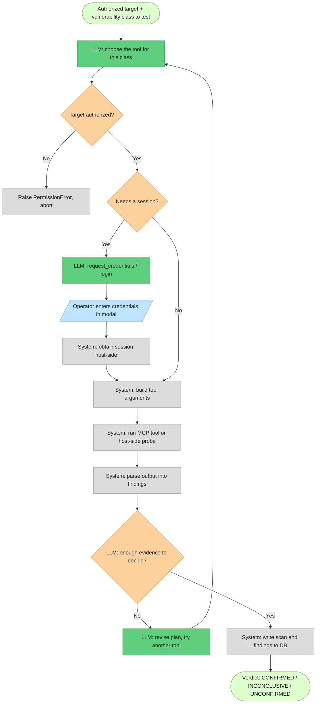

# How It Works

> Docs: [project flow](project_flow.md) · [benchmark](benchmark.md)

The harness is a terminal (TUI) harness for authorized penetration testing. The operator describes a task in
natural language. the harness plans the work, runs security tools against the target through a remote Kali MCP
server, parses the output into findings, stores them in SQLite, and optionally annotates them with an LLM.

Tools do not run locally. Execution is delegated to the `DansPK/kali-mcp-server` running on a Kali VM, which
The harness talks to over its own MCP client. Two host-side probes (`upload`, `httpprobe`) are the only
exceptions; they make HTTP requests directly from the harness host.

Active scanning requires the target to be marked authorized. This is enforced in `ScanManager.run_profile`,
which raises `PermissionError` for any unauthorized target. The check is in code and does not depend on the
LLM.

## Contents

1. [Architecture](#1-architecture)
2. [Core data types](#2-core-data-types)
3. [Request lifecycle](#3-request-lifecycle)
4. [The agent loop](#4-the-agent-loop)
5. [Scanners and profiles](#5-scanners-and-profiles)
6. [Authenticated testing (credentials)](#6-authenticated-testing-credentials)
7. [PoC execution](#7-poc-execution)
8. [Storage and configuration](#8-storage-and-configuration)
9. [Running the harness](#9-running-the-harness)
10. [Testing and extending](#10-testing-and-extending)
11. [Appendix A — support matrix](#appendix-a--support-matrix)
12. [Appendix B — caveats](#appendix-b--caveats)

---

## 1. Architecture

### Components

| Layer | Module | Responsibility |
|---|---|---|
| UI | `harness/ui/chat.py` (`ChatApp`) | Read operator input, render the event stream, show the credential modal |
| Agent | `harness/agent.py` (`Agent`) | Drive the LLM tool-calling loop; implement the tools |
| LLM client | `harness/llm/client.py` (`LLMClient`) | Call an OpenAI-compatible chat endpoint |
| Executor | `harness/scanners/manager.py` (`ScanManager`) | Run an ordered list of tools against a target, persist results |
| Scanner adapters | `harness/scanners/*.py` | Map a target + options onto one MCP tool (or a host-side probe) |
| MCP client | `harness/mcp_client.py` (`KaliMCP`) | Connect to the Kali MCP server, discover tools, invoke them |
| Parsers | `harness/utils/parsers.py` | Convert raw tool output into `Finding` objects |
| Storage | `harness/db.py` (`Database`) | SQLite tables for targets, scans, findings |
| Models | `harness/models.py` | Shared dataclasses and enums |

### Data flow

```
operator ──▶ ChatApp ──▶ Agent ──▶ LLMClient ──▶ chat endpoint
                 ▲          │
         events  │          │ tool calls (run_scan, login, …)
                 │          ▼
                 │      ScanManager ──▶ scanner adapter ──▶ KaliMCP ──▶ Kali MCP server (VM)
                 │          │                                              nmap, nuclei, sqlmap, zap, …
                 │          ▼
                 └──── Database (SQLite)
```

The agent calls the LLM, the LLM requests tool calls, the agent executes them, and the results are fed back
to the LLM until it produces a final answer with no further tool calls. Scans run through `ScanManager`,
which writes findings to the database as each tool completes. The UI reads events from the agent and renders
them; it also reads targets and findings back from the database for the slash commands.

### Front-ends

| Command | Entry point | LLM required |
|---|---|---|
| `harness` | `ui/chat.py` → `Agent` | Yes — the natural-language agent |
| `harness classic` | `ui/main.py` | No — tabbed TUI that drives `ScanManager` directly |
| `harness pentest <url>` | `pentest.py:run_pentest` | No — fixed pipeline, writes a report |
| `/pentest`, `/scan` (in chat) | `pentest.py:run_pentest` | No — same fixed pipeline from the chat UI |

The LLM-free paths exist so the tool still works when the model is unavailable or slow. The rest of this
document describes the default `harness` agent.

---

## 2. Core data types

Defined in `harness/models.py` and used across every layer:

- `Target` — `name`, `type` (`TargetType`: web/api/network/source), `value` (URL, host, or path),
  `authorized` (bool), `id`.
- `Finding` — `scan_id`, `severity` (`Severity`: info/low/medium/high/critical, each with a numeric `rank`),
  `title`, `description`, `evidence`, `location`, `verified`, `ai_analysis`, `id`.
- `ScanResult` — one tool run: `scanner`, `status` (pending/running/completed/failed/skipped), `findings`,
  `raw_output`, `error`.

---

## 3. Request lifecycle

What happens when the operator types a request in the chat UI:

1. `ChatApp.on_input_submitted` runs the input in a Textual worker and calls
   `Agent.chat(text, on_event, on_ask)`.
2. `Agent.chat` appends the message to the conversation history and enters the tool-calling loop (§4).
3. On each round the LLM may call tools. Target and finding tools touch the database directly; `run_scan`
   invokes `ScanManager`, which calls the Kali MCP server.
4. Each tool result is appended to the history and sent back to the LLM.
5. When the LLM returns a message with no tool calls, that text is the final answer and the turn ends.
6. The agent emits events throughout (`plan`, `assistant`, `tool_start`, `tool_progress`, `tool_end`); the UI
   renders them inline.

Conversation history persists across turns. The plan (§4) is reset at the start of each new request.

---

## 4. The agent loop

The loop is `Agent.chat` in `harness/agent.py`. Each round is one call to `LLMClient.raw_chat` with the full
tool set. The assistant message may contain text (shown to the operator) and/or tool calls (executed by the
agent). There is one LLM call per round; the model is expected to include a short reasoning line together
with its next tool call rather than in a separate call.

A typical task proceeds as:

1. The model calls `update_plan` with an ordered checklist, starting with reconnaissance.
2. Each round, the model states what the last result means and calls the next tool.
3. After a scan, the model reads the returned findings and revises the plan with `update_plan`, choosing the
   next tool based on what was found (§5 lists the heuristics).
4. When the task is complete, the model returns a summary with no tool call, which ends the loop.

### Tools

Schemas are in `TOOLS` (`harness/agent.py`); dispatch is in `Agent._dispatch`.

| Tool | Purpose |
|---|---|
| `update_plan` | Set or revise the step checklist |
| `add_target` | Register a target (authorized only if the operator said so) |
| `list_targets` | List targets and their authorized flag |
| `authorize_target` | Mark an existing target authorized |
| `run_scan` | Run one or more scanners (or a named profile) against a target; returns the top findings |
| `login` | Authenticate with a username/password at a login endpoint; return the session |
| `request_credentials` | Open the secure input modal in the UI and return the session |
| `list_findings` | List stored findings for a target |
| `get_finding` | Return full detail for one finding |
| `list_capabilities` | List the available scanners and profiles |

Scanners are not separate tools; they are invoked through `run_scan` with an explicit `tools` list or a
`profile` name.

### Termination

The loop is bounded. It ends on the first of:

1. The model returns a message with no tool calls (the normal case). The system prompt instructs the model
   to stop once it has enough evidence to confirm a vulnerability class, and to stop testing a class that
   its appropriate tool reports clean.
2. A round in which every tool call repeats a `(tool, arguments)` pair already run this turn. The repeated
   calls are answered (the API requires a response per call) but not re-executed, and the loop stops.
3. A fixed budget of 20 rounds. If reached, the agent makes one final call with no tools offered, forcing the
   model to return a text summary, and the turn ends.

### Events

`Agent.chat` takes an async `on_event` callback. Event types and their rendering in `ui/chat.py`:

| Event | Emitted when | Rendered as |
|---|---|---|
| `plan` | `update_plan` runs | A checklist with per-step status |
| `assistant` | The model returns text | `● harness …` |
| `tool_start` | Before a tool runs | `⏺ tool(arguments)` |
| `tool_progress` | During a scan | An indented progress line |
| `tool_end` | A tool returns | A one-line summary of the result |

A second callback, `on_ask`, lets the agent request input from the UI and receive a value back. It is used by
the credential modal (§6).

---

## 5. Scanners and profiles

A scanner adapter (`harness/scanners/`) subclasses `BaseScanner` and declares a `tool_name` and a `parser`.
`build_args` maps the target and options onto the MCP tool's input schema using `adapt_target_args`, which
reads the schema discovered at runtime so argument names are not hardcoded. `run_args` sends the call;
`parse` converts the raw output into findings.

Wired adapters: `nmap`, `nuclei`, `nuclei-dast` (the nuclei tool with `-dast` options), `sqlmap`, `nikto`,
`commix`, `whatweb`, `gobuster`, `zap`, `upload` (host-side), `httpprobe` (host-side). They are registered in
`harness/scanners/__init__.py:SCANNERS`.

Profiles are named, ordered tool lists in `config/harness.yaml` (`recon`, `standard`, `full`, `web-deep`,
`dast`, `zap`). `run_scan` accepts either a profile name or an explicit `tools` list.

`run_scan` returns the top findings (worst severity first) rather than only counts, so the model can decide
the next step from the evidence. The system prompt encodes the following reconnaissance-to-next-step
heuristics:

| Observation | Next step |
|---|---|
| Technology stack or language fingerprinted | Targeted nuclei templates; sqlmap if the endpoint is dynamic |
| An additional open web port (nmap) | Scan that port |
| A reflected value or a `?param=` URL | `nuclei-dast` (active parameter fuzzing with OAST) |
| A login form, admin area, or 401/403 | Obtain credentials (§6), then run authenticated scans |
| An injection surface | sqlmap (SQLi); ZAP active scan (XSS, command injection, traversal) |

---

## 6. Authenticated testing (credentials)

When the attack surface requires a login, the agent obtains a session before scanning. It does not guess or
brute-force credentials unless the operator explicitly asks to test default or weak credentials.

Three ways a session is acquired:

1. `request_credentials` opens a modal in the UI (`CredentialModal`). The operator enters a login URL,
   username, and password (or a token or cookie). Password and token fields are masked. The host performs the
   login and returns the session; the raw password is not sent to the LLM and is not written to the chat log.
2. `login` performs the same login from a username and password the operator gave in chat. It extracts a JWT
   (via `_find_token`, which searches common JSON keys) or a Set-Cookie.
3. The operator pastes a token or cookie directly.

How the session is carried into a scan depends on its form:

- A Bearer/JWT session is used through the host-side `httpprobe` tool
  (`options="token=<jwt> path=<endpoint> ids=<ids>"`). `httpprobe` builds the `Authorization` header itself.
- A space-free cookie is passed in a scanner's `run_scan` options (for example `--cookie=session=<value>`).

The reason for the split: the Kali MCP server splits a tool's option string on whitespace. The value
`Bearer <jwt>` contains a space, so passing it as `-H 'Authorization: Bearer <jwt>'` through `run_scan`
options produces an empty header and a 401. A cookie value has no space and is unaffected. `httpprobe` avoids
the problem by running host-side.

If no secure input is available (for example a headless run) or the operator cancels, the agent falls back to
asking in chat, or records the authenticated surface as untested and continues with the unauthenticated
tests. The `login` helper handles single-request form or JSON logins; multi-step, CSRF, or SSO logins require
a pasted token.

---

## 7. PoC execution

PoC execution is one `run_scan` pass: the step that runs a tool to prove or rule out a vulnerability on an
authorized target, records the evidence, and reports a verdict. In the broader controlled-exploitation flow
it sits after the scope, risk, and approval checks and before the CONFIRMED / INCONCLUSIVE / UNCONFIRMED
verdict.

Diagram node types: green = LLM decision; grey = system process; orange = condition; blue = operator input.



Steps, with the code path for each:

1. The planner selects the tool for the class from `list_capabilities` and the §5 heuristics (for example
   sqlmap for SQLi, `httpprobe` for IDOR/BOLA, ZAP active for XSS).
2. `ScanManager.run_profile` re-checks `target.authorized` and raises `PermissionError` if it is not set.
3. If the surface requires a session, the agent obtains one (§6) before the scan.
4. The adapter builds the tool arguments (`adapt_target_args`), merging any per-tool options from `run_scan`
   onto the defaults in `config/harness.yaml`.
5. The tool runs: MCP tools on the Kali VM via `KaliMCP.run`; `upload` and `httpprobe` via HTTP from the
   the harness host. A failure in one tool is recorded and does not abort the others.
6. The parser (`harness/utils/parsers.py`) converts the raw output into findings. Parsers never raise on
   malformed input.
7. `ScanManager` writes the scan row, the findings, and the raw output to SQLite. This is the "record
   evidence" step.
8. The model reads the returned findings and decides: confirmed (mark the step done, move on), inconclusive
   or needs another angle (revise the plan and try a different tool), or clean (mark the class ruled out).
9. Findings of high or critical severity are passed to the LLM analyzer, which writes an explanation into the
   finding's `ai_analysis`. This is best-effort and is skipped if the LLM is unavailable.

Verdict mapping:

| Verdict | Condition |
|---|---|
| CONFIRMED | A decisive finding, usually `verified=True` or high severity from a proof tool (sqlmap naming the DBMS, `httpprobe` returning another user's object) |
| INCONCLUSIVE | The tool ran but the signal is ambiguous (status-only response against an SPA catch-all, OAST server unreachable, commix wrapper broken) |
| UNCONFIRMED | The appropriate tool ran and returned nothing (for example sqlmap reports no injectable parameter) |

An ambiguous result is recorded as inconclusive, not as a positive.

Example (benchmark Run 4, 63 seconds, authenticated BOLA):

1. Plan: recon, login, BOLA test, injection test, summarize.
2. `login` with a username and password returns a JWT; the agent reads its own basket id (12) from the token.
3. `httpprobe` with `token=<jwt> path=/rest/basket ids=12,1,2,3` returns HTTP 200 for every id. Basket 1 is
   1310 bytes of another user's cart; the agent's own basket 12 is 155 bytes. `parse_httpprobe` records a
   high-severity Broken Access Control finding with `verified=True`.
4. sqlmap against the basket id path parameter returns no injection, so that class is marked unconfirmed.
5. The plan is complete; the loop ends. BOLA is confirmed, injection is unconfirmed.

---

## 8. Storage and configuration

### Storage

`harness/db.py` uses SQLite with a fresh connection per operation, which is safe to call from Textual
worker threads. Three tables, cascading on delete: `targets` → `scans` → `findings`. `ScanManager` writes a
scan row and its findings as each tool completes; `findings_for_target(target_id)` reads them back.

### Configuration

Secrets and connection settings come from `.env`; non-secret defaults come from `config/harness.yaml`
(`harness/config.py`). Relevant variables:

- `KALI_MCP_TRANSPORT` — `stdio` (SSH to the VM), `http`, or `sse`.
- `KALI_MCP_URL`, `KALI_MCP_AUTH_TOKEN` — for the HTTP/SSE transports.
- `HARNESS_LLM_BASE_URL`, `HARNESS_LLM_API_KEY`, `HARNESS_LLM_MODEL` — the OpenAI-compatible endpoint. If
  unset, scans still run but findings get no AI analysis and the natural-language agent is unavailable.

---

## 9. Running the harness

```bash
python -m venv .venv && source .venv/bin/activate
pip install -e ".[dev]"
cp .env.example .env            # set HARNESS_LLM_* and KALI_MCP_* (see CLAUDE.md)

harness doctor                 # verify MCP connectivity and LLM configuration
harness                        # natural-language agent (default)
harness classic                # tabbed TUI, no LLM
harness pentest <url>          # fixed pipeline, writes a report, no LLM
```

In the chat UI, slash commands run without the LLM: `/pentest <url>`, `/scan <url> [profile]`, `/targets`,
`/findings`, `/help`. Plain text goes to the agent. Esc cancels the current turn; Ctrl+L clears the log.

Scanners run on the Kali VM, so a target URL must be reachable from the VM. For a service on the harness
host, use the host's address on the VM network (for example `192.168.210.1`), not `localhost`. Only scan
hosts you own or are authorized to test.

---

## 10. Testing and extending

`pytest` runs fully offline. `tests/test_parsers.py` covers the parsers; `tests/test_agent_loop.py` covers
the loop (planning, adaptivity, the repeat guard, the round-cap summary, credential resolution, token
extraction, and IDOR/BOLA parsing) by stubbing `raw_chat` and `_run_scan`. No VM, LLM, or network is
required.

To extend:

- New scanner: subclass `BaseScanner`, set `tool_name` and `parser`, implement `target_value`, register it in
  `SCANNERS`, and add it to a profile in `config/harness.yaml`.
- New profile: add a named tool list under `profiles:` in `config/harness.yaml`.
- New agent tool: add a schema to `TOOLS` and a branch in `Agent._dispatch`. New UI event types can be added
  to `_event` in `ui/chat.py`; unrecognized event types are ignored, so changes can be made incrementally.

---

## Appendix A — support matrix

Benchmarked against a purpose-built vulnerable lab and OWASP Juice Shop.

Support: Yes = auto-detected by a wired tool; Agent = verified by the agent or manually; the tool is present
but does not auto-flag the class.

### Exploitation classes

| Class (OWASP) | Support | Tool(s) | Confirmation |
|---|---|---|---|
| SQL Injection (A03) | Yes | sqlmap, ZAP active | sqlmap names the DBMS and techniques |
| Cross-Site Scripting (A03) | Yes | ZAP active | reflected marker returned unescaped |
| Command Injection (A03) | Yes | ZAP active | OS command injection alert (commix wrapper is broken; see Appendix B) |
| SSRF (A10) | Yes | nuclei-dast + OAST | interactsh callback on the `url` parameter |
| Path Traversal / LFI (A01) | Yes | ZAP active, nuclei-dast | file contents retrieved |
| Authentication Bypass (A07) | Agent | sqlmap (login SQLi), manual | login SQLi payload authenticates |
| Default Credentials (A07) | Agent | hydra, manual | known credentials authenticate |
| Security Misconfiguration (A05) | Yes | nuclei, nikto, ZAP | missing security headers, version leak, open CORS |
| Broken Access Control / IDOR / BOLA (A01) | Yes | httpprobe | one session reads objects it does not own |
| File Upload (A04) | Yes | upload probe | a marked file is stored and retrieved verbatim |
| Known CVEs (A06) | Yes | searchsploit, nuclei | version-to-CVE mapping |
| Service Vulnerabilities (A06) | Yes | nmap -sV, searchsploit | service banner to CVE |

Ten of twelve classes are auto-detected by a wired tool. Authentication Bypass and Default Credentials are
verified by the agent or manually.

### Tool coverage

| Tool | Classes |
|---|---|
| ZAP (active) | SQLi, XSS, command injection, path traversal/LFI, misconfiguration |
| sqlmap | SQL injection; login SQLi for auth bypass |
| nuclei | misconfiguration, CVE templates, default-login, exposed panels |
| nuclei-dast | SSRF (OAST), LFI, reflected injections |
| upload (host-side) | unrestricted file upload |
| httpprobe (host-side) | IDOR/BOLA; authenticated status and body confirmation |
| nikto | misconfiguration, server version, exposed paths |
| nmap -sV + searchsploit | service vulnerabilities, version-to-CVE |
| whatweb | fingerprinting |
| gobuster | content and directory discovery |

---

## Appendix B — caveats

- commix does not work through this MCP server. The server runs the tool with inherited stdin, so commix
  reads targets from stdin and ignores `--url`. Use ZAP active scan for command injection. Server fix:
  pass the URL as `input_data`.
- SSRF detection needs the Kali VM to reach the OAST server (`oast.fun` / `oast.live`). ZAP's standard active
  scan does not flag blind SSRF.
- The host-side probes (`upload`, `httpprobe`) require the target to be reachable from the harness host.
- Passing a Bearer token through `run_scan` options fails because the MCP server splits options on
  whitespace. Use `httpprobe` for Bearer/JWT sessions, or a space-free cookie for scanner tools (see §6).
- sqlmap at the default `--level 1 --risk 1` misses payload-specific injections. Raise the level and risk, or
  target the known endpoint.
- ZAP shares one session per host and port. Reset it (`zap_stop`) between targets on the same host and port,
  or active scans return stale alerts from the previous target.
- nikto maps severity conservatively; some findings stored as `info` are higher risk.
- The custom lab runs no genuinely vulnerable software, so nuclei CVE templates produce no behavioral hits.
  Its `Server: Apache/2.4.49` header is spoofed to exercise the version-to-CVE path.

---

The original design blueprint is `project-spec.md` (repo root); the code is a slice of it. A sample generated
report is `lumina-pentest-report.md` (repo root).
